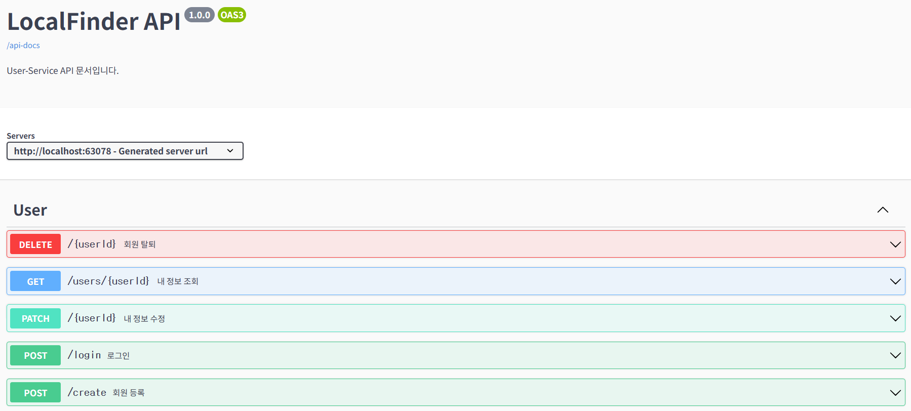
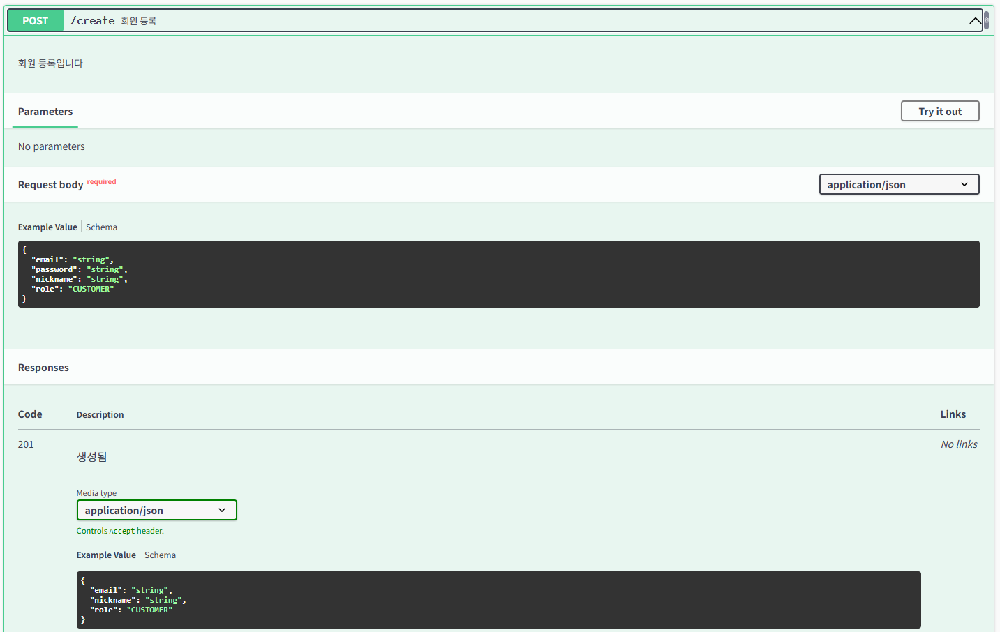
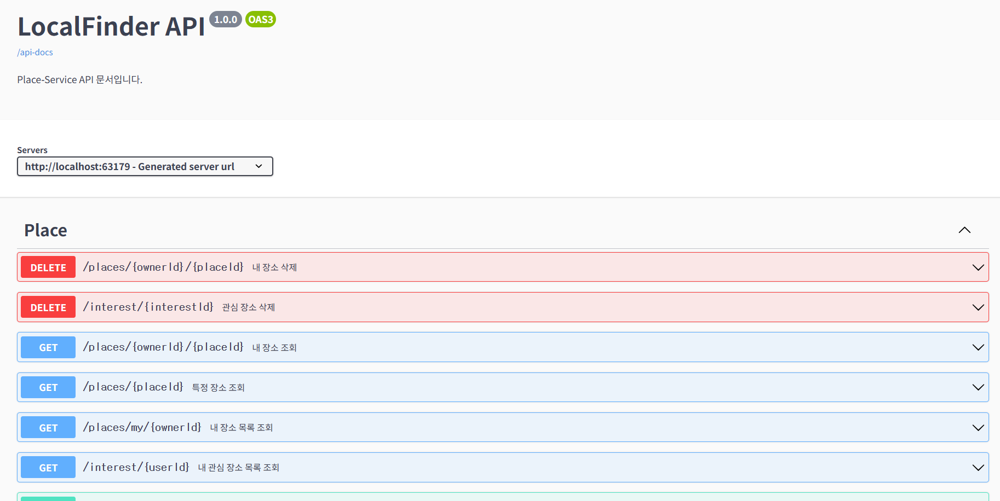
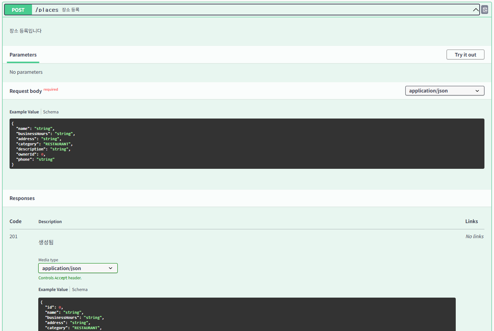
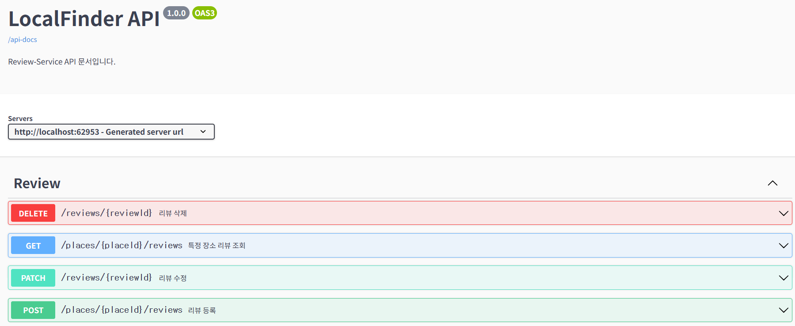
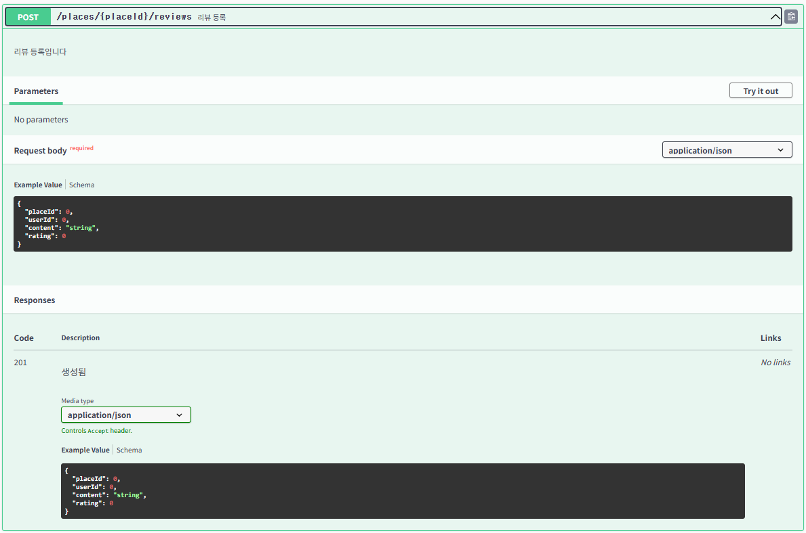
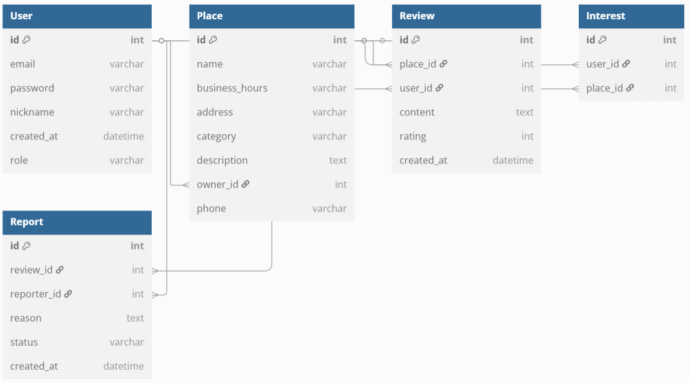

# 🌐 LocalFinder - 지역 정보 플랫폼

- **프로젝트명**: LocalFinder
- **개발 기간**: 2025.04 ~ 개발 중
- **목표**: 사용자와 지역 사업자가 장소(식당/카페/관광지) 정보를 등록, 조회, 리뷰할 수 있는 지역 정보 공유 플랫폼
- **개발 형태**: MSA 기반 웹 프로젝트 (개인)

---

### 기술 스택

| 구분       | 사용 기술 |
|------------|-----------|
| Language   | Java, JavaScript |
| Backend    | Spring Boot, Spring Cloud, Spring Security |
| Frontend   | React, React Router |
| DB         | MySQL, JPA |
| Infra      | Kafka, Eureka, Spring Cloud Gateway, docker |
| Dev Tools  | IntelliJ, Insomnia, GitHub, Swagger |

---

### 시스템 아키텍처

- 서비스 구성: `user-service`, `place-service`, `review-service`, `apigateway-service`, `discovery-service`
- Kafka 기반 비동기 이벤트 처리

---

### 서비스 구성

**1) user-service**
  + 회원가입 / 로그인 / JWT 인증
  + 사용자 탈퇴 시 Kafka 메시지 발행

**2) place-service**
  + 장소 등록 / 조회 / 수정 / 관심 장소 등록
  + 사용자 탈퇴 이벤트 수신 → 관련 장소 비활성화

**3) review-service**
  + 리뷰 등록 / 조회 / 신고 기능
  + 사용자 및 장소 삭제 이벤트 수신 처리

**4) apigateway-service**
  + API 요청의 진입점 역할

**5) discovery-service**
  + 각 서비스 간 탐색 및 등록 기능 (Eureka)

---

### Kafka 이벤트 흐름

**1) user-service**
+ topic : user-cretaed
  + 구독 서비스 : review-service (유저 정보를 저장하고 리뷰 등록 시 사용)

**2) place-service**
+ topic : place-cretaed
  + 구독 서비스 : review-service (리뷰 작성 시 유효한 장소인지 검증)

**3) review-service**
+ topic : review-added
  + 구독 서비스 : place-service (장소 평점 계산 반영)
  + 구독 서비스 : user-service (유저 리뷰 활동 기록)

---

### 주요 API 명세 (Swagger UI)

### 1) user-service

### 2) place-service

### 3) review-service

---

### ERD 설계

